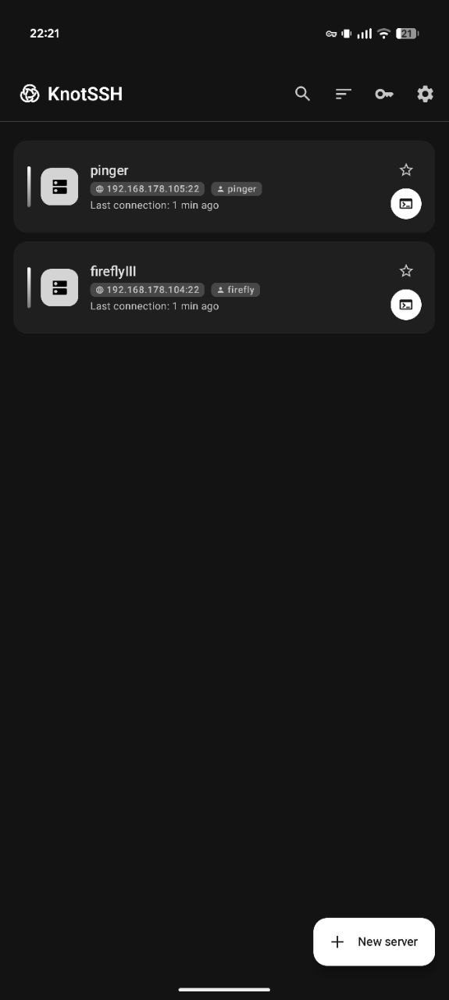
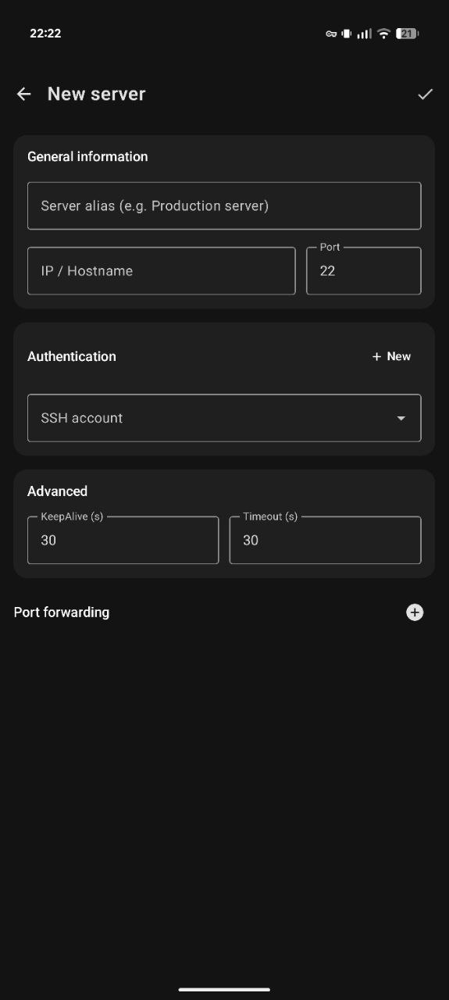
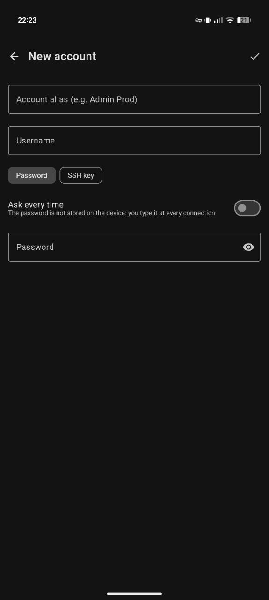
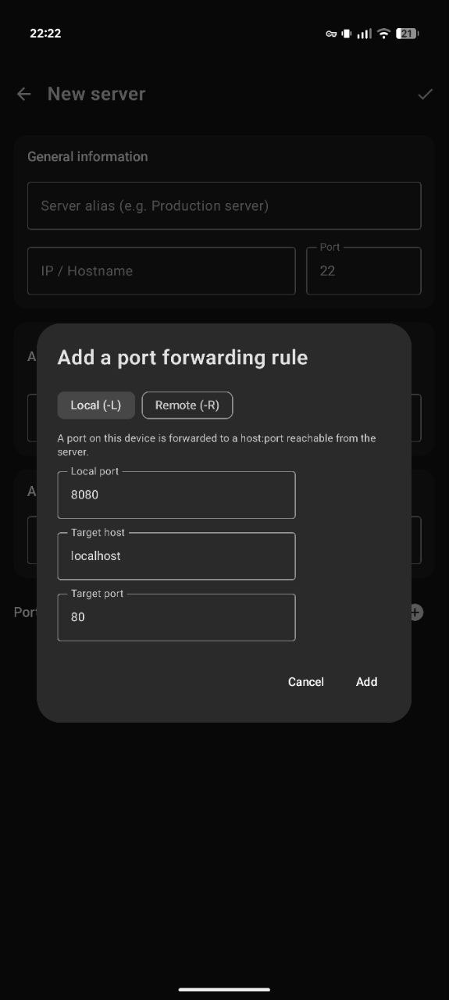
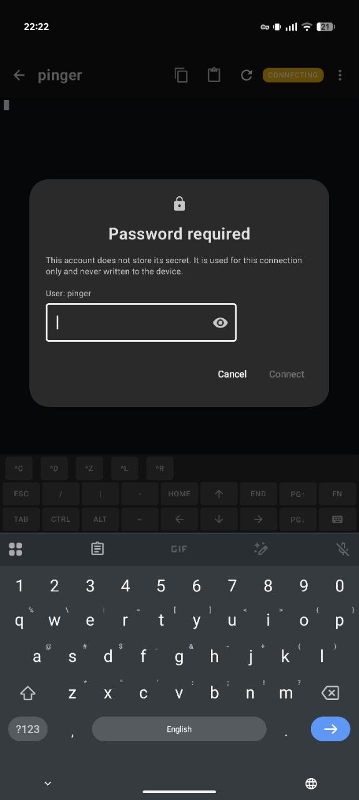
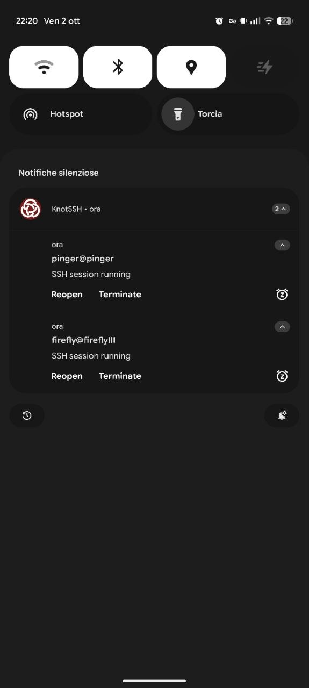
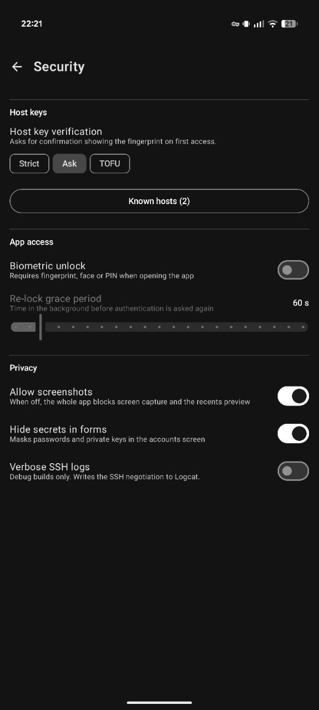

<p align="center">
  
</p>

<h1 align="center">KnotSSH</h1>

<p align="center">An SSH client for Android, built with Kotlin and Jetpack Compose.</p>

<p align="center">
  <a href="https://github.com/Jacopo1891/KnotSSH/actions/workflows/release.yml"></a> <a href="https://github.com/Jacopo1891/KnotSSH/releases/latest"></a> <a href="https://github.com/Jacopo1891/KnotSSH/releases"></a>  <a href="LICENSE"></a>
</p>

KnotSSH keeps everything on the device. There is no account to create, no backend to trust, and no analytics or telemetry of any kind. Servers, credentials and keys live in the app's private storage, and the diagnostic log never records hostnames, accounts, keys or terminal output.

---

## Screenshots

| Your servers                                                                  | Add a server                                                                     | Reusable accounts                                                                  | Port forwarding                                                                            |
| ----------------------------------------------------------------------------- | -------------------------------------------------------------------------------- | ---------------------------------------------------------------------------------- | ------------------------------------------------------------------------------------------ |
|  |  |  |  |

| Connect                                                                                           | Sessions keep running                                                                                        | Security options                                                                 |
| ------------------------------------------------------------------------------------------------- | ------------------------------------------------------------------------------------------------------------ | -------------------------------------------------------------------------------- |
|  |  |  |

## Features

- **Interactive terminal** with multiple concurrent sessions that survive backgrounding, swipe scrolling for full-screen apps, and configurable fonts and colours.
- **Authentication** by password or SSH key, with an optional _ask each time_ mode so secrets are never stored.
- **Host key verification** against a known-hosts store, including import of an existing `known_hosts` file.
- **Port forwarding**, local (`-L`) and remote (`-R`).
- **Server organisation** with folders and favourites.
- **Quick commands** and custom terminal keys.
- **Encrypted backup** to a portable `.knotssh` container, with the key derived from a password using Argon2id.
- **Biometric unlock**.
- **Localised** in English, Italian, French, Spanish and German.

## Requirements

Android 12 (API 31) or newer.

---

## Install

Download the latest `KnotSSH-<version>.apk` from the [releases page](https://github.com/Jacopo1891/KnotSSH/releases/latest) and open it on the device. Android will ask you to allow installation from unknown sources, since the app is not distributed through an app store.

Every release lists the SHA-256 checksum of the APK. Verify it before installing:

```sh
sha256sum KnotSSH-<version>.apk
```

All releases are signed with the same key. Android will refuse to install an update signed with a different one, which also means you should only install APKs published on this repository.

---

## Build from source

You need JDK 21 and the Android SDK.

```sh
git clone https://github.com/Jacopo1891/KnotSSH.git
cd KnotSSH
./gradlew assembleDebug
```

The debug APK is written to `app/build/outputs/apk/debug/`.

### Release builds

`versionName` and `versionCode` are derived from the git tag, so a release build refuses to run unless `HEAD` is exactly a clean `vMAJOR.MINOR.PATCH` tag. Signing is read from four Gradle properties, which are never committed:

```properties
KNOTSSH_STORE_FILE=/absolute/path/to/keystore.jks
KNOTSSH_STORE_PASSWORD=...
KNOTSSH_KEY_ALIAS=...
KNOTSSH_KEY_PASSWORD=...
```

Put them in `~/.gradle/gradle.properties`, or pass them as `-P` flags or `ORG_GRADLE_PROJECT_*` environment variables. Without them the build still produces an APK, but an unsigned one, so a release never silently falls back to the shared debug key.

## Tech stack

Kotlin · Jetpack Compose · Material 3 · Hilt · Room · ataStore otlin Coroutines · kotlinx.serialization

## Contributing

Bug reports and suggestions are welcome in the [issues](https://github.com/Jacopo1891/KnotSSH/issues). The app can open a prefilled issue for you from _Settings → App info → Send a bug report_, with the diagnostic log copied to your clipboard and ready to paste.

---

## Third-party licenses

| Library                                                        | License     |
| -------------------------------------------------------------- | ----------- |
| [JSch (mwiede fork)](https://github.com/mwiede/jsch)           | Revised BSD |
| [argon2kt](https://github.com/lambdapioneer/argon2kt)          | MIT         |
| AndroidX, Jetpack Compose, Hilt, Kotlin, kotlinx.serialization | Apache 2.0  |

## License

Released under the [MIT License](LICENSE). You are free to use, modify and redistribute it, including commercially, as long as the copyright notice and the licence text are kept.

---

## Support

If KnotSSH is useful to you, you can support its development:

<a href="https://buymeacoffee.com/jacopo1891d" target="_blank"></a>
